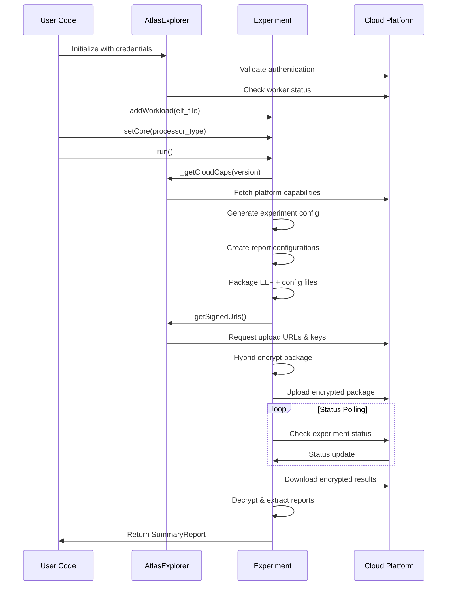
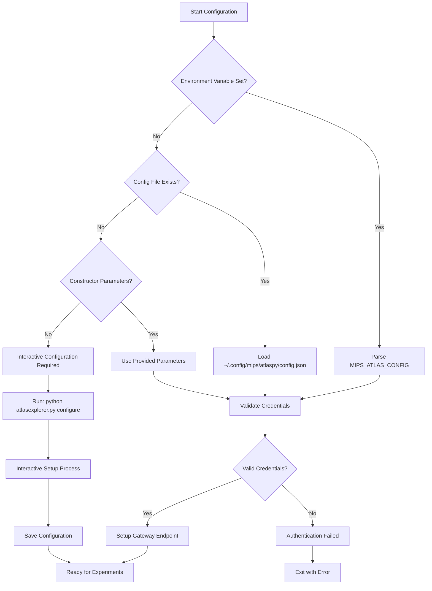

# MIPS Atlas Explorer Python API

A comprehensive Python client library for the MIPS Atlas Explorer cloud-based processor performance analysis platform. This library enables developers to run detailed CPU performance experiments, analyze workloads, and generate comprehensive reports on MIPS processor architectures.

## Table of Contents

- [Overview](#overview)
- [Architecture](#architecture)
- [Installation & Setup](#installation--setup)
- [Core Classes](#core-classes)
- [Detailed Class Documentation](#detailed-class-documentation)
- [Security Features](#security-features)
- [Workflow Explanation](#workflow-explanation)
- [API Endpoints](#api-endpoints)
- [Error Handling](#error-handling)
- [Configuration Management](#configuration-management)
- [Examples](#examples)
- [Troubleshooting](#troubleshooting)

## Overview

The MIPS Atlas Explorer Python API (`atlasexplorer.py`) is a sophisticated client library that provides programmatic access to MIPS's cloud-based processor simulation and analysis platform. It enables researchers, engineers, and developers to:

- **Run CPU Performance Experiments**: Execute ELF binaries on simulated MIPS processor cores
- **Analyze Workload Behavior**: Generate detailed instruction counts, traces, and performance metrics
- **Security-First Design**: Uses hybrid encryption (RSA + AES-GCM) for secure data transmission
- **Multi-Architecture Support**: Compatible with various MIPS processor cores (I8500, P8500, etc.)
- **Comprehensive Reports**: Generate summary statistics, instruction analysis, and performance insights

### Key Features

- **🔐 Enterprise Security**: Hybrid RSA/AES encryption with OAEP padding
- **📊 Rich Analytics**: Instruction counts, traces, cycle analysis, and performance metrics
- **🏗️ ELF Binary Analysis**: DWARF debug information extraction and source file mapping
- **🌍 Multi-Region Support**: Global cloud infrastructure with regional endpoints
- **🔄 Asynchronous Processing**: Non-blocking experiment execution with status polling
- **📈 Performance Insights**: Detailed CPU utilization and bottleneck analysis

## Architecture

```
┌─────────────────────────────────────────────────────────────────┐
│                    MIPS Atlas Explorer API                     │
├─────────────────────────────────────────────────────────────────┤
│ ┌─────────────────┐ ┌─────────────────┐ ┌─────────────────┐   │
│ │   AtlasExplorer │ │   AtlasConfig   │ │  AtlasConstants │   │
│ │                 │ │                 │ │                 │   │
│ │ • Main API      │ │ • Config Mgmt   │ │ • Global Consts │   │
│ │ • Cloud Comms   │ │ • Credentials   │ │ • API Endpoints │   │
│ │ • Worker Status │ │ • Gateway Setup │ │                 │   │
│ └─────────────────┘ └─────────────────┘ └─────────────────┘   │
├─────────────────────────────────────────────────────────────────┤
│ ┌─────────────────┐ ┌─────────────────┐                       │
│ │   Experiment    │ │  SummaryReport  │                       │
│ │                 │ │                 │                       │
│ │ • ELF Upload    │ │ • Metrics       │                       │
│ │ • Encryption    │ │ • Analysis      │                       │
│ │ • Report Gen    │ │ • Visualization │                       │
│ │ • Status Poll   │ │                 │                       │
│ └─────────────────┘ └─────────────────┘                       │
├─────────────────────────────────────────────────────────────────┤
│                    Security & Utilities                        │
│ • Hybrid Encryption (RSA + AES-GCM)                           │
│ • DWARF Debug Info Parsing                                     │
│ • Source File Discovery                                        │
│ • Secure File Transfer                                         │
└─────────────────────────────────────────────────────────────────┘
```

## Installation & Setup

### Prerequisites

```bash
pip install requests
pip install uuid
pip install cryptography
pip install pycryptodome
pip install pyelftools
pip install inquirerpy
pip install python-dotenv
```

### Initial Configuration

1. **Interactive Configuration**:
```bash
python atlasexplorer.py configure
```

2. **Environment Variable Configuration**:
```bash
export MIPS_ATLAS_CONFIG="your_api_key:your_channel:your_region"
```

3. **Configuration File** (stored in `~/.config/mips/atlaspy/config.json`):
```json
{
    "apikey": "your_api_key",
    "channel": "your_channel", 
    "region": "your_region"
}
```

## Core Classes

### 1. AtlasExplorer
The main orchestration class that manages cloud connections, authentication, and high-level operations.

### 2. Experiment  
Handles individual performance experiments, including ELF file processing, report generation, and result analysis.

### 3. SummaryReport
Provides analysis and visualization of experiment results, including performance metrics and insights.

### 4. AtlasConfig
Manages authentication credentials, regional settings, and API gateway configuration.

### 5. AtlasConstants
Contains global configuration constants and API endpoint definitions.

## Detailed Class Documentation

### AtlasExplorer Class

**Purpose**: Main API client for interacting with the MIPS Atlas Explorer cloud platform.

**Key Responsibilities**:
- Cloud service authentication and connection management
- Worker status monitoring and health checks
- Version compatibility verification
- Processor core capability discovery

#### Constructor Parameters:
```python
def __init__(self, apikey=None, channel=None, region=None, verbose=False):
```

- `apikey` (str, optional): API authentication key
- `channel` (str, optional): Service channel identifier  
- `region` (str, optional): Geographic region for processing
- `verbose` (bool): Enable detailed logging output

#### Core Methods:

**`_getCloudCaps(version)`**
- **Purpose**: Fetches cloud platform capabilities for a specific version
- **Process**: 
  1. Makes authenticated request to `/cloudcaps` endpoint
  2. Parses available processor architectures and features
  3. Stores capabilities for later use in experiment configuration
- **Error Handling**: Exits with detailed error if capabilities cannot be fetched

**`getCoreInfo(core)`**
- **Purpose**: Retrieves detailed information about a specific processor core
- **Parameters**: `core` (str) - Core identifier (e.g., "I8500", "P8500")
- **Returns**: Dictionary containing core architecture details
- **Validation**: Verifies core is supported by current cloud capabilities

**`getVersionList()`**
- **Purpose**: Returns list of available platform versions
- **Returns**: List of version strings
- **Usage**: Helps users select compatible toolchain versions

**`__checkWorkerStatus()`**
- **Purpose**: Validates that cloud processing workers are available
- **Process**:
  1. Makes authenticated request to `/dataworkerstatus`
  2. Parses worker availability and capacity information
  3. Provides detailed error reporting for connection issues
- **Returns**: Status dictionary with availability information

**`getSignedUrls(expuuid, name, core)`**
- **Purpose**: Obtains secure, time-limited URLs for experiment upload
- **Security**: Uses signed URLs to prevent unauthorized access
- **Returns**: Response containing upload URL, public key, and status endpoint

---

### Experiment Class

**Purpose**: Manages individual performance analysis experiments from creation to completion.

**Key Responsibilities**:
- ELF binary processing and analysis
- Secure experiment package creation and upload
- Real-time experiment status monitoring
- Result download and processing
- Report generation and organization

#### Constructor Parameters:
```python
def __init__(self, expdir, atlas, verbose=True):
```

- `expdir` (str): Local directory for experiment storage
- `atlas` (AtlasExplorer): Main API client instance
- `verbose` (bool): Enable detailed progress logging

#### Experiment Workflow Methods:

**`addWorkload(workload)`**
- **Purpose**: Adds an ELF binary to the experiment
- **Validation**: Verifies file existence and accessibility
- **Parameters**: `workload` (str) - Path to ELF binary file
- **Multiple Workloads**: Supports adding multiple binaries for complex experiments

**`setCore(core)`** 
- **Purpose**: Specifies the target processor core for simulation
- **Parameters**: `core` (str) - Core identifier
- **Validation**: Core compatibility is verified during experiment execution

**`run(expname=None, unpack=True)`**
- **Purpose**: Executes the complete experiment workflow
- **Process Overview**:
  1. **Experiment Initialization**
  2. **Configuration Generation** 
  3. **Package Creation and Encryption**
  4. **Secure Upload**
  5. **Status Monitoring**
  6. **Result Download and Processing**

#### Detailed `run()` Method Workflow:

**Phase 1: Experiment Setup**
```python
# Generate unique experiment identifier
now = datetime.now()
self.experiment_timestamp = now.strftime("%y%m%d_%H%M%S")
expuuid = self.experiment_timestamp + "_" + str(uuid.uuid4())
```

**Phase 2: Configuration Generation**
```python
experimentConfigDict = {
    "date": date_string,
    "name": expname,
    "core": self.core,
    "workload": workload_objs,
    "uuid": expuuid,
    "toolsVersion": "latest",
    "timeout": 300,
    "pluginVersion": "0.0.97",
    "otp": "".join([chr(x) for x in get_random_bytes(32)]),  # Encryption key
    "arch": {"num_threads": 1},
    "clientType": "python"
}
```

**Phase 3: Report Configuration**
- Creates summary report configuration
- Generates instruction count and trace report configurations
- Each report gets unique UUID and processing parameters

**Phase 4: Package Creation**
```python
# Create compressed archive with config and ELF files
with tarfile.open(workload_tar_path, "w:gz") as tar:
    tar.add(config_file, arcname="config.json")
    for workload in self.workloads:
        tar.add(workload, arcname=os.path.basename(workload))
```

**Phase 5: Security & Upload**
```python
# Obtain signed URLs and encryption keys
resp = self.atlas.getSignedUrls(expuuid, expname, self.core)
packageURL = resp.json()["exppackageurl"]
publicKey = resp.json()["publicKey"] 
statusURL = resp.json()["statusget"]

# Apply hybrid encryption
self.__hybrid_encrypt(publicKey, workload_tar_path)

# Upload encrypted package
self.__uploadExpPackage(packageURL, workload_tar_path)
```

**Phase 6: Status Monitoring**
```python
# Poll experiment status every 2 seconds, up to 10 attempts
while count < 10:
    count += 1
    time.sleep(2)
    status = self.__getStatus(statusURL)
    
    if status["code"] == 100:      # In progress
        print("experiment is being generated.....")
    elif status["code"] == 200:   # Complete
        print("experiment is ready, downloading now")
        # Download results
        break
    elif status["code"] == 404:   # Not found
        break
    elif status["code"] == 500:   # Error
        print("error generating experiment, escaping now")
        break
```

**Phase 7: Result Processing**
```python
if self.unpack:
    # Download encrypted results
    self.__downloadBinaryFile(url, self.expdir, self.expname + ".tar.gz")
    
    # Decrypt using OTP from configuration
    self.__decrypt_file_with_password(reporttar, experimentConfigDict["otp"])
    
    # Extract reports
    with tarfile.open(reporttar, "r:gz") as tar:
        tar.extractall(destdir, filter='tar')
    
    # Clean invalid summary files
    self.cleanSummaries("summary")
    
    # Load summary report for analysis
    if os.path.exists(summaryjson):
        self.summary = SummaryReport(summaryjson)
```

#### Security Methods:

**`__hybrid_encrypt(public_key_pem, input_file)`**
- **Purpose**: Implements hybrid encryption for secure file transmission
- **Algorithm**: RSA-OAEP + AES-256-GCM
- **Process**:
  1. Generate random 256-bit AES key and 128-bit IV
  2. Encrypt file data with AES-GCM
  3. Encrypt AES key with RSA public key (OAEP padding)
  4. Combine IV + encrypted_key + auth_tag + encrypted_data
- **Security Features**: 
  - Perfect Forward Secrecy (random AES keys)
  - Authenticated encryption (GCM mode)
  - RSA-OAEP prevents padding oracle attacks

**`__decrypt_file_with_password(src_file_path, password)`**
- **Purpose**: Decrypts downloaded experiment results
- **Algorithm**: AES-256-ECB with scrypt key derivation
- **Process**:
  1. Derive 256-bit key using scrypt (N=16384, r=8, p=1)
  2. Decrypt using AES-256-ECB
  3. Remove PKCS#7 padding
  4. Validate padding correctness
- **Security**: scrypt provides resistance against brute-force attacks

#### ELF Analysis Methods:

**`snapshotSource(elfPath)`**
- **Purpose**: Extracts source file information from ELF DWARF debug data
- **Process**:
  1. Parse ELF file using pyelftools
  2. Extract DWARF debug information
  3. Iterate through compilation units
  4. Build complete source file paths
  5. Verify file existence
- **Returns**: Set of existing source file paths
- **Use Case**: Enables source-level analysis correlation

**`__creatReportNested(reporttype, reportName, expconfig, elfName, zstfName)`**
- **Purpose**: Generates report configuration objects
- **Report Types**: 
  - `summary`: Overall performance metrics
  - `inst_counts`: Instruction frequency analysis  
  - `inst_trace`: Detailed execution trace
- **Configuration**: Each report gets unique UUID and processing parameters

#### Utility Methods:

**`cleanSummaries(report)`**
- **Purpose**: Removes invalid ROI (Region of Interest) summary files
- **Validation**: Checks if summary has zero cycles and instructions
- **Cleanup**: Automatically removes corrupted or empty reports

**`getExperiment(expdir, atlas=None, verbose=True)`**
- **Purpose**: Factory method for loading existing experiments
- **Parameters**: Directory path containing experiment data
- **Returns**: New Experiment instance configured for the directory

---

### SummaryReport Class

**Purpose**: Provides analysis and access to experiment performance data.

**Data Structure**: Parses JSON performance reports generated by the cloud platform.

#### Constructor:
```python
def __init__(self, jsonfile):
```
- Loads JSON performance data
- Extracts total cycles and instructions
- Handles both single-thread and multi-thread metrics
- Removes internal ordering keys

#### Core Metrics:

**`getTotalCycles()`**
- **Returns**: Total CPU cycles consumed during execution
- **Usage**: Primary metric for performance comparison

**`getTotalInstructions()`**
- **Returns**: Total instructions executed
- **Compatibility**: Handles both single and multi-thread reports

#### Advanced Analysis Methods:

**`getMetricKeys(regex_pattern=None)`**
- **Purpose**: Returns list of all available performance metrics
- **Filtering**: Optional regex pattern for metric selection
- **Use Cases**:
  ```python
  # Get all cache-related metrics
  cache_metrics = report.getMetricKeys(r".*[Cc]ache.*")
  
  # Get all instruction metrics  
  inst_metrics = report.getMetricKeys(r".*[Ii]nstruction.*")
  ```

**`getMetricValue(key)`**
- **Purpose**: Retrieves specific metric value by key
- **Returns**: Numeric value for the specified performance metric
- **Error Handling**: Returns None if key doesn't exist

**`printMetrics(regex_pattern=None)`**
- **Purpose**: Formatted display of performance metrics
- **Features**:
  - Locale-aware number formatting (thousands separators)
  - Regex filtering for specific metric categories
  - Handles both integer and floating-point values
  - Professional report formatting

#### Example Metrics Available:
- Total Cycles Consumed
- Total Instructions Retired  
- Instructions Per Cycle (IPC)
- Cache Hit/Miss Rates
- Branch Prediction Accuracy
- Memory Access Patterns
- Pipeline Utilization
- Register Usage Statistics

---

### AtlasConfig Class

**Purpose**: Manages authentication, regional settings, and API gateway configuration.

**Configuration Priority** (highest to lowest):
1. Environment variable (`MIPS_ATLAS_CONFIG`)
2. Configuration file (`~/.config/mips/atlaspy/config.json`)
3. Constructor parameters
4. Interactive configuration

#### Constructor Parameters:
```python
def __init__(self, readonly=False, verbose=True, apikey=None, channel=None, region=None):
```

#### Configuration Methods:

**`setGWbyChannelRegion()`**
- **Purpose**: Dynamically determines optimal API gateway endpoint
- **Process**:
  1. Makes request to global API with credentials
  2. Receives region-specific gateway endpoint
  3. Stores endpoint for subsequent API calls
  4. Handles network errors gracefully
- **Error Handling**: Provides detailed error messages and fallback behavior

#### Configuration Storage:

**Environment Variable Format**:
```bash
MIPS_ATLAS_CONFIG="apikey:channel:region"
```

**Configuration File Location**:
```
~/.config/mips/atlaspy/config.json
```

**File Format**:
```json
{
    "apikey": "your_api_key_here",
    "channel": "production",  
    "region": "us-west-2"
}
```

---

### AtlasConstants Class

**Purpose**: Centralized storage for API endpoints and configuration keys.

```python
class AtlasConstants:
    AE_GLOBAL_API = "https://gyrfalcon.api.mips.com"
    CONFIG_ENVAR = "MIPS_ATLAS_CONFIG"
```

## Security Features

### Hybrid Encryption System

The Atlas Explorer API implements enterprise-grade security through a hybrid encryption approach:

#### RSA + AES Hybrid Encryption

1. **AES-256-GCM Encryption**:
   - Symmetric encryption for large data (ELF files, configurations)
   - Galois/Counter Mode provides authenticated encryption
   - Random 256-bit keys generated per experiment
   - 128-bit initialization vectors for security

2. **RSA-OAEP Key Protection**:
   - Asymmetric encryption protects AES keys
   - OAEP padding prevents padding oracle attacks
   - SHA-256 hash function for additional security
   - Public key provided by cloud platform

3. **Security Benefits**:
   - **Perfect Forward Secrecy**: Each experiment uses unique keys
   - **Data Integrity**: GCM authentication prevents tampering
   - **Confidentiality**: Multi-layer encryption protects sensitive data
   - **Non-Repudiation**: Signed URLs ensure authorized access

### Authentication & Authorization

- **API Key Authentication**: Secure API keys for user identification
- **Signed URLs**: Time-limited, secure upload endpoints
- **Regional Validation**: Requests validated against user's authorized regions
- **Channel Isolation**: Multi-tenant security through channel separation

## Workflow Explanation

### Complete Experiment Lifecycle



### Configuration Workflow



## API Endpoints

### Global API Base
```
https://gyrfalcon.api.mips.com
```

### Core Endpoints

| Endpoint | Method | Purpose | Authentication |
|----------|---------|---------|----------------|
| `/user` | GET | Validate API key | API Key Header |
| `/channellist` | GET | List available channels | API Key Header |
| `/gwbychannelregion` | GET | Get regional gateway | API Key Header |
| `/cloudcaps` | GET | Platform capabilities | API Key Header |
| `/createsignedurls` | POST | Generate upload URLs | API Key Header |
| `/dataworkerstatus` | GET | Check worker health | API Key Header |

### Regional Gateway Endpoints

Dynamic endpoints determined by `gwbychannelregion`:

| Endpoint | Method | Purpose | Security |
|----------|---------|---------|----------|
| `{gateway}/cloudcaps` | GET | Version capabilities | Authenticated |
| `{gateway}/createsignedurls` | POST | Experiment upload | Authenticated |
| `{gateway}/dataworkerstatus` | GET | Worker availability | Authenticated |

### Request/Response Examples

**Channel List Request**:
```http
GET /channellist HTTP/1.1
Host: gyrfalcon.api.mips.com
apikey: your_api_key_here
extversion: 0.0.97
```

**Channel List Response**:
```json
{
  "channels": [
    {
      "name": "production",
      "regions": "[\"us-west-2\", \"eu-west-1\", \"ap-southeast-1\"]"
    }
  ]
}
```

**Signed URLs Request**:
```http
POST {gateway}/createsignedurls HTTP/1.1
apikey: your_api_key
channel: production
exp-uuid: 250811_105432_abc123-def456-789
workload: experiment_name
core: I8500
action: experiment
```

**Signed URLs Response**:
```json
{
  "exppackageurl": "https://s3.amazonaws.com/signed-upload-url",
  "publicKey": "-----BEGIN PUBLIC KEY-----\nMII...",
  "statusget": "https://gateway.mips.com/status/uuid"
}
```

## Error Handling

### Exception Categories

#### Network Errors
```python
try:
    response = requests.get(url, headers=headers, timeout=10)
    response.raise_for_status()
except requests.RequestException as e:
    print(f"Network error: {e}")
    return {"status": False, "error": str(e)}
```

#### Authentication Errors
```python
def __getUserValid(apikey):
    url = AE_GLOBAL_API + "/user"
    response = requests.get(url, headers={"apikey": apikey})
    return response.status_code == 200
```

#### Encryption Errors
```python
try:
    # Encryption process
    encrypted_data = encrypt_function()
except Exception as error:
    print("Encryption error:", error)
    raise EncryptionException("Failed to encrypt experiment data")
```

#### File System Errors
```python
def addWorkload(self, workload):
    if not os.path.exists(workload):
        print(f"Error: specified elf file does not exist\nELF: {workload}")
        sys.exit(1)
    self.workloads.append(workload)
```

### Status Code Handling

| Code | Meaning | Action |
|------|---------|---------|
| 100 | Processing | Continue polling |
| 200 | Success | Download results |
| 404 | Not Found | Stop polling |
| 500 | Server Error | Exit with error |

## Configuration Management

### Configuration Precedence

1. **Environment Variable** (`MIPS_ATLAS_CONFIG`)
   ```bash
   export MIPS_ATLAS_CONFIG="key123:production:us-west-2"
   ```

2. **Configuration File**
   ```json
   // ~/.config/mips/atlaspy/config.json
   {
     "apikey": "key123",
     "channel": "production", 
     "region": "us-west-2"
   }
   ```

3. **Constructor Parameters**
   ```python
   atlas = AtlasExplorer(
       apikey="key123",
       channel="production",
       region="us-west-2"
   )
   ```

4. **Interactive Setup**
   ```bash
   python atlasexplorer.py configure
   ```

### Interactive Configuration Process

The `configure` command provides a step-by-step setup process:

1. **API Key Validation**:
   - Prompts for API key input
   - Validates key against global API
   - Shows default from existing configuration

2. **Channel Selection**:
   - Fetches available channels for user
   - Presents interactive list for selection
   - Auto-selects if only one channel available

3. **Region Selection**:
   - Lists regions available in selected channel
   - Interactive selection with defaults
   - Auto-selects single region

4. **Configuration Storage**:
   - Saves to `~/.config/mips/atlaspy/config.json`
   - Creates `.env` file in current directory
   - Provides environment variable format for CI/CD

## Examples

### Basic Single-Core Experiment

```python
#!/usr/bin/env python3
from atlasexplorer import AtlasExplorer, Experiment

# Initialize Atlas Explorer client
atlas = AtlasExplorer(verbose=True)

# Create experiment in 'myexperiments' directory  
exp = Experiment('myexperiments', atlas)

# Configure experiment
exp.addWorkload('path/to/your/binary.elf')
exp.setCore('I8500')

# Run experiment
exp.run(expname='my_performance_test', unpack=True)

# Analyze results
summary = exp.getSummary()
if summary:
    print(f"Total Cycles: {summary.getTotalCycles():,}")
    print(f"Total Instructions: {summary.getTotalInstructions():,}")
    print(f"IPC: {summary.getTotalInstructions() / summary.getTotalCycles():.3f}")
```

### Advanced Multi-Workload Analysis

```python
#!/usr/bin/env python3
from atlasexplorer import AtlasExplorer, Experiment
import os

# Initialize with specific configuration
atlas = AtlasExplorer(
    apikey="your_api_key",
    channel="production", 
    region="us-west-2",
    verbose=True
)

# Create experiment
exp = Experiment('experiments/multiworkload_analysis', atlas)

# Add multiple workloads for comparison
workloads = [
    'benchmarks/dhrystone.elf',
    'benchmarks/coremark.elf', 
    'benchmarks/whetstone.elf'
]

for workload in workloads:
    if os.path.exists(workload):
        exp.addWorkload(workload)

# Configure for high-performance core
exp.setCore('P8500')

# Run with custom name
exp.run(expname='benchmark_comparison_P8500', unpack=True)

# Detailed analysis
summary = exp.getSummary()
if summary:
    # Print all performance metrics
    print("=== Performance Summary ===")
    summary.printMetrics()
    
    # Focus on specific metrics
    print("\n=== Cache Performance ===")
    cache_metrics = summary.getMetricKeys(r".*[Cc]ache.*")
    for metric in cache_metrics:
        value = summary.getMetricValue(metric)
        print(f"{metric}: {value}")
    
    # Calculate derived metrics
    cycles = summary.getTotalCycles()
    instructions = summary.getTotalInstructions()
    ipc = instructions / cycles if cycles > 0 else 0
    
    print(f"\n=== Key Performance Indicators ===")
    print(f"Instructions Per Cycle: {ipc:.3f}")
    print(f"Cycles Per Instruction: {cycles/instructions:.3f}")
    print(f"Performance Score: {instructions/cycles*1000:.1f}")
```

### Source Code Analysis Integration

```python
#!/usr/bin/env python3
from atlasexplorer import AtlasExplorer, Experiment

# Create experiment with source analysis
exp = Experiment('source_analysis', AtlasExplorer())
exp.addWorkload('debug_build.elf')  # ELF with DWARF debug info
exp.setCore('I8500')

# Run experiment  
exp.run('source_correlation_analysis')

# Extract source file information
source_files = exp.snapshotSource('debug_build.elf')
print("Source files found in ELF:")
for source in sorted(source_files):
    print(f"  {source}")

# Analyze performance with source context
summary = exp.getSummary()
if summary:
    print(f"\nPerformance for {len(source_files)} source files:")
    print(f"Total Cycles: {summary.getTotalCycles():,}")
    print(f"Average Cycles/Source File: {summary.getTotalCycles()/len(source_files):,.1f}")
```

### Error Handling and Robustness

```python
#!/usr/bin/env python3
from atlasexplorer import AtlasExplorer, Experiment
import sys
import os

def robust_experiment_runner():
    try:
        # Initialize with error checking
        atlas = AtlasExplorer(verbose=True)
        
        # Verify ELF file exists
        elf_path = 'path/to/binary.elf'
        if not os.path.exists(elf_path):
            print(f"Error: ELF file not found: {elf_path}")
            return False
            
        # Create experiment with error handling
        exp_dir = 'robust_experiments'
        os.makedirs(exp_dir, exist_ok=True)
        exp = Experiment(exp_dir, atlas)
        
        # Configure experiment
        exp.addWorkload(elf_path)
        exp.setCore('I8500')
        
        # Run with error handling
        exp.run('robust_test_experiment')
        
        # Verify results
        summary = exp.getSummary()
        if summary:
            cycles = summary.getTotalCycles()
            instructions = summary.getTotalInstructions()
            
            if cycles > 0 and instructions > 0:
                print(f"✅ Experiment successful!")
                print(f"   Cycles: {cycles:,}")
                print(f"   Instructions: {instructions:,}")
                print(f"   IPC: {instructions/cycles:.3f}")
                return True
            else:
                print("❌ Invalid results: zero cycles or instructions")
                return False
        else:
            print("❌ No summary report generated")
            return False
            
    except Exception as e:
        print(f"❌ Experiment failed: {e}")
        return False

# Run robust experiment
if __name__ == "__main__":
    success = robust_experiment_runner()
    sys.exit(0 if success else 1)
```

## Troubleshooting

### Common Issues and Solutions

#### Authentication Problems

**Issue**: "Invalid API Key" error
```python
# Solution: Verify API key validity
def test_api_key():
    from atlasexplorer import __getUserValid
    apikey = "your_api_key_here"
    if __getUserValid(apikey):
        print("✅ API key is valid")
    else:
        print("❌ API key is invalid")
```

**Issue**: Configuration not found
```bash
# Solution: Run interactive configuration
python atlasexplorer.py configure

# Or set environment variable
export MIPS_ATLAS_CONFIG="key:channel:region"
```

#### Network and Connectivity Issues

**Issue**: Gateway connection failures
```python
# Solution: Test gateway connectivity
def test_connectivity():
    import requests
    try:
        response = requests.get("https://gyrfalcon.api.mips.com/user", 
                              headers={"apikey": "your_key"}, 
                              timeout=10)
        print(f"Connection status: {response.status_code}")
    except requests.RequestException as e:
        print(f"Connection failed: {e}")
```

**Issue**: Timeout errors during experiment
```python
# Solution: Increase timeout and add retry logic
def run_with_retry(experiment, max_retries=3):
    for attempt in range(max_retries):
        try:
            experiment.run()
            return True
        except TimeoutError:
            print(f"Attempt {attempt + 1} timed out, retrying...")
            time.sleep(5)
    return False
```

#### File and ELF Issues

**Issue**: ELF file not found
```python
# Solution: Validate file paths
def validate_elf_file(elf_path):
    if not os.path.exists(elf_path):
        print(f"❌ ELF file not found: {elf_path}")
        return False
    
    if not os.access(elf_path, os.R_OK):
        print(f"❌ ELF file not readable: {elf_path}")
        return False
        
    # Check if it's actually an ELF file
    try:
        with open(elf_path, 'rb') as f:
            magic = f.read(4)
            if magic != b'\x7fELF':
                print(f"❌ File is not an ELF binary: {elf_path}")
                return False
    except Exception as e:
        print(f"❌ Error reading ELF file: {e}")
        return False
        
    print(f"✅ ELF file validated: {elf_path}")
    return True
```

**Issue**: Encryption/Decryption errors
```python
# Solution: Verify encryption dependencies
def check_crypto_dependencies():
    try:
        from cryptography.hazmat.primitives import serialization
        from Crypto.Cipher import AES
        from Crypto.Random import get_random_bytes
        print("✅ Cryptography libraries available")
        return True
    except ImportError as e:
        print(f"❌ Missing cryptography dependency: {e}")
        print("Install with: pip install cryptography pycryptodome")
        return False
```

#### Experiment Execution Issues

**Issue**: Experiment stuck in processing state
```python
# Solution: Implement enhanced status monitoring
def monitor_experiment_status(experiment, max_wait_minutes=30):
    import time
    start_time = time.time()
    max_wait_seconds = max_wait_minutes * 60
    
    while time.time() - start_time < max_wait_seconds:
        status = experiment._Experiment__getStatus(status_url)
        print(f"Status: {status.get('code')} - {time.ctime()}")
        
        if status["code"] == 200:  # Complete
            return True
        elif status["code"] in [404, 500]:  # Error states
            return False
        
        time.sleep(10)  # Check every 10 seconds
    
    print("❌ Experiment timed out")
    return False
```

**Issue**: Invalid or corrupted results
```python
# Solution: Validate experiment results
def validate_experiment_results(experiment):
    summary = experiment.getSummary()
    if not summary:
        print("❌ No summary report found")
        return False
    
    cycles = summary.getTotalCycles()
    instructions = summary.getTotalInstructions()
    
    if cycles <= 0:
        print("❌ Invalid cycle count")
        return False
    
    if instructions <= 0:
        print("❌ Invalid instruction count")
        return False
    
    ipc = instructions / cycles
    if ipc > 10.0:  # Sanity check
        print("⚠️ Unusually high IPC, results may be invalid")
        
    print("✅ Experiment results validated")
    print(f"   Cycles: {cycles:,}")
    print(f"   Instructions: {instructions:,}")
    print(f"   IPC: {ipc:.3f}")
    return True
```

### Debugging Tips

#### Enable Verbose Logging
```python
# Enable detailed output for debugging
atlas = AtlasExplorer(verbose=True)
experiment = Experiment('debug_exp', atlas, verbose=True)
```

#### Inspect Configuration
```python
# Check current configuration
config = AtlasConfig(verbose=True)
print(f"API Key: {config.apikey[:8]}...")
print(f"Channel: {config.channel}")
print(f"Region: {config.region}")
print(f"Gateway: {config.gateway}")
```

#### Validate Environment
```python
# Complete environment validation
def validate_environment():
    checks = [
        ("Python Version", sys.version_info >= (3, 7)),
        ("Requests Available", __import__('requests')),
        ("Crypto Available", __import__('cryptography')),
        ("ELF Tools Available", __import__('elftools')),
        ("Config File Exists", os.path.exists(os.path.expanduser('~/.config/mips/atlaspy/config.json'))),
    ]
    
    for check_name, check_result in checks:
        status = "✅" if check_result else "❌"
        print(f"{status} {check_name}")
    
    return all(check[1] for check in checks)
```

This comprehensive documentation provides detailed insights into how the MIPS Atlas Explorer Python API works, following PEP-8 conventions and explaining every major component, workflow, and security feature in the system.
